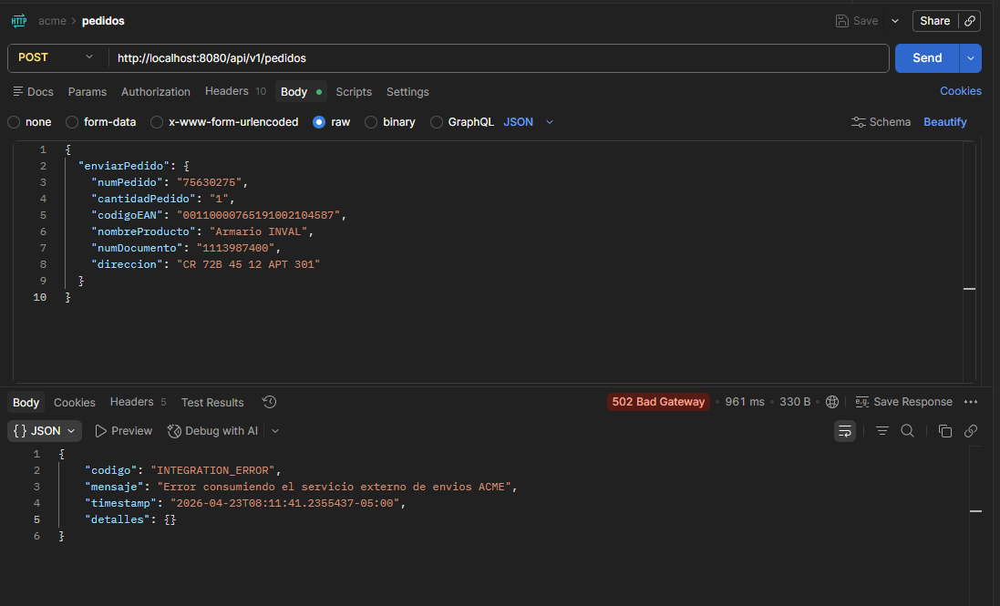

# ACME Help

## Descripcion General

Esta aplicacion implementa una API REST para el ciclo de abastecimiento de ACME.
La tienda envia un pedido en formato JSON y el sistema:

1. recibe la solicitud REST,
2. transforma el mensaje a SOAP/XML,
3. consume el servicio externo de envios,
4. interpreta la respuesta XML,
5. retorna una respuesta JSON clara para el cliente.


## Flujo De Integracion

### Entrada REST

La API recibe un `POST` con `application/json` en:

```text
http://localhost:8080/api/v1/pedidos
```

### Request JSON

```json
{
  "enviarPedido": {
    "numPedido": "75630275",
    "cantidadPedido": "1",
    "codigoEAN": "00110000765191002104587",
    "nombreProducto": "Armario INVAL",
    "numDocumento": "1113987400",
    "direccion": "CR 72B 45 12 APT 301"
  }
}
```

### Transformacion JSON A SOAP/XML

Mapeo aplicado:

- `numPedido` -> `pedido`
- `cantidadPedido` -> `Cantidad`
- `codigoEAN` -> `EAN`
- `nombreProducto` -> `Producto`
- `numDocumento` -> `Cedula`
- `direccion` -> `Direccion`

Estructura SOAP generada:

```xml
<soapenv:Envelope xmlns:soapenv="http://schemas.xmlsoap.org/soap/envelope/" xmlns:env="http://WSDLs/EnvioPedidos/EnvioPedidosAcme">
  <soapenv:Header/>
  <soapenv:Body>
    <env:EnvioPedidoAcme>
      <EnvioPedidoRequest>
        <pedido>75630275</pedido>
        <Cantidad>1</Cantidad>
        <EAN>00110000765191002104587</EAN>
        <Producto>Armario INVAL</Producto>
        <Cedula>1113987400</Cedula>
        <Direccion>CR 72B 45 12 APT 301</Direccion>
      </EnvioPedidoRequest>
    </env:EnvioPedidoAcme>
  </soapenv:Body>
</soapenv:Envelope>
```

### Transformacion SOAP/XML A JSON

Mapeo de respuesta:

- `Codigo` -> `codigoEnvio`
- `Mensaje` -> `estado`

### Response JSON

```json
{
  "enviarPedidoRespuesta": {
    "codigoEnvio": "80375472",
    "estado": "Entregado exitosamente al cliente"
  }
}
```

## Configuracion

La URL del servicio externo se configura en `application.properties`:

```properties
acme.soap.url=https://run.mocky.io/v3/19217075-6d4e-4818-98bc-416d1feb7b84
```

Tambien puede definirse por variable de entorno:

```bash
ACME_SOAP_URL=https://otro-endpoint
```

## Importante

El endpoint suministrado actualmente responde `404 Not Found`.
La aplicacion queda correctamente implementada y lista para integrarse, pero para una prueba funcional completa se requiere una URL externa valida.

## Comandos Utiles

### Ejecutar En Local

En PowerShell:

```powershell
.\mvnw.cmd spring-boot:run
```

En Linux o Git Bash:

```bash
./mvnw spring-boot:run
```

### Ejecutar Pruebas

```bash
./mvnw test
```

### Generar Artefacto

```bash
./mvnw -DskipTests package
```

## cURL Para Postman

Puedes importar este cURL directamente en Postman:

```bash
curl --location 'http://localhost:8080/api/v1/pedidos' \
--header 'Content-Type: application/json' \
--data '{
  "enviarPedido": {
    "numPedido": "75630275",
    "cantidadPedido": "1",
    "codigoEAN": "00110000765191002104587",
    "nombreProducto": "Armario INVAL",
    "numDocumento": "1113987400",
    "direccion": "CR 72B 45 12 APT 301"
  }
}'
```

## Docker

### Construir Imagen

```bash
docker build -t acme-api .
```

### Ejecutar Contenedor

```bash
docker run -p 8080:8080 -e ACME_SOAP_URL=https://otro-endpoint acme-api
```

## Estructura Del Proyecto

```text
src
├── main
│   ├── java/co/com/acme
│   │   ├── application
│   │   ├── config
│   │   ├── controller
│   │   ├── domain
│   │   ├── infrastructure
│   │   └── web
│   └── resources
└── test
```

## Repositorio

Repositorio remoto configurado:

```text
https://github.com/JohnJairo1024/acme.git
```

## Recomendacion Final

Para sustentacion tecnica, esta solucion puede defenderse como una integracion empresarial desacoplada entre `REST/JSON` y `SOAP/XML`, construida con buenas practicas de arquitectura, patrones de diseño y principios SOLID.


## Captura

